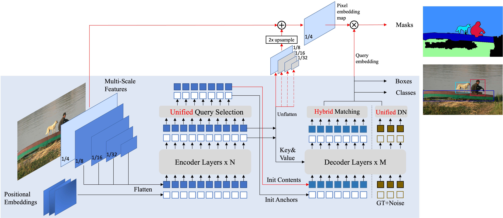

# 문제의 수식 및 텍스트 인식을 위한 Scene Text Detection 시스템

## 개요
Mask-DINO 모델: Object Detection과 Segmentation을 통합하는 Framework로 단어(word) 단위의 텍스트 검출을 추출할 수 있는 모델.   
모델에 관한 자세한 내용은 [Mask-DINO 논문](https://arxiv.org/abs/2206.02777)을 참조하세요.   
다양한 모델에 대한 학습은 [Mask-DINO 코드](https://github.com/IDEA-Research/MaskDINO)을 참조하세요.   


### 주요 기능
- 문제 인식을 위한 텍스트 및 수식 객체 검출 학습
- 다중 GPU 지원을 통한 고속 학습
- 다양한 데이터 증강 기법 적용
- 데모 폴더를 통한 시각화 및 평가 지원

## 목차
1. [설치 방법](#설치-방법)
2. [사용 방법](#사용-방법)
2. [모델 설명](#모델-설명)
3. [데이터셋](#데이터셋)
4. [성능](#성능)

***

## 설치 방법
[설치 방법](INSTALL.md).




***


## 사용 방법

### 학습

명령을 실행하기 전에 export DETECTRON2_DATASETS=/path/to/your/data심볼릭 링크를 추가하거나 사용하여 ln -s 데이터 세트를 이 저장소에 연결.
config에 따라 ResNet-50, Swin-L 등의 Backbone 및 Segmentation 여부 및 진행 방법 선택 가능.

기본 학습 명령어 Example:
```shell
python3 train_net.py --num-gpus 2 --config-file configs/coco/instance-segmentation/maskdino_R50_bs16_50ep_3s.yaml MODEL.WEIGHTS weights/maskdino_r50_50ep_300q_hid1024_3sd1_instance_maskenhanced_mask46.1ap_box51.5ap.pth
```
학습된 모델 결과 출력 및 평가 Example:
```shell
python3 demo/demo_mectric.py --config-file configs/coco/instance-segmentation/maskdino_R50_bs16_50ep_3s.yaml --input /home/tmax/workspace/hj/MaskDINO/maskdino_dataset/* --output results --opts MODEL.WEIGHTS /home/tmax/workspace/hj/MaskDINO/output/model_0229999.pth
```

주요 학습 옵션:
- `--resume`: 학습 중단 시 재개
- `--config-file`: 모델 설정 파일 지정
- `--eval-only`: 모델 MAP평가만 수행
- `--num_gpus`: 사용할 GPU 개수 지정
- `--num_machines`: 사용할 총 머신(컴퓨터)의 개수를 지정
- `--dist-url`: 분산 학습을 위한 통신 방식을 설정하는 옵션으로 분산 학습 시 여러 노드(머신)와 프로세스들이 서로 통신할 수 있도록 네트워크 URL을 지정


## 모델 설명

이 프로젝트는 Mask-DINO 모델 기반으로 학습되었습니다.
### Mask-DINO 모델 주요 학습 설정
- ResNet 및 Swin transformer 기반의 백본
- Contrastive Denoising
- Mixed Query Selection
- Look-Forward Twice
- Multi-scale deformable attention
- 입력 이미지 크기: 1024
- 쿼리 개수: 800개 (디노이징 쿼리: 100개)
- AdamW 옵티마이저, WarmupPolyLR 스케줄러
- Batch size: 1
- 30 에폭 학습

### 데이터 Augmentation
 - RandomFlip (Horizontal, vertical)
 - ResizeScale
 - FixedSizeCrop
 - RandomContrast
 - RandomBrightness
 - RandomLighting
 - RandomHueSaturationValue
 - RandomBlur

## 데이터셋

### 데이터셋 구조
데이터셋의 구조는 다음과 같습니다:
```shell
datasets/
├── 데이터명/
│   ├── train_images/
│   │   ├── image1.png
│   │   ├── image2.png
│   │   └── ...
│   ├── val_images/
│   │   ├── image1.png
│   │   ├── image2.png
│   │   └── ...
│   ├── train_labels_combination_1024_word_rle_convex.json
└── └── val_labels_combination_1024_word_rle_convex.json
```


### 학습 데이터셋
|데이터 이름|개수|설명|
|:---:|:---:|:---:|
|Generated Dataset Version 1|10000장|한글 및 수식이 혼합된 Dataset|
|Generated Dataset Version 2|10000장|한글 및 수식이 혼합된 Dataset (여백, 작은 숫자, 수식 추가)|
|AIHUB 한국어 글자체 이미지 Dataset|5000장|정형화된 한글이미지 Dataset|
|AIHUB 금융업 특화 문서 OCR Dataset|5000장|비정형화 한글 이미지 Dataset|
|SynthText 한국어 글자체 이미지|10000장|다양한 배경화면에 대한 한글 이미지 Dataset|
|중,고등수학 문제집 데이터셋|10000장|한글 및 수식이 혼합된 수학 문제 이미지 Dataset|


### 검증 데이터셋
BenchMark Dataset
|데이터 이름|개수|설명|
|:---:|:---:|:---:|
|Generated Dataset Version 1|2000장|한글 및 수식이 혼합된 Dataset 평가|
|Generated Dataset Version 2|2000장|한글 및 수식이 혼합된 Dataset (여백, 작은 숫자, 수식 추가) 평가|
|AIHUB 한국어 글자체 이미지 Dataset|1000장|정형화된 한글이미지 Dataset 평가|
|AIHUB 금융업 특화 문서 OCR Dataset|1000장|비정형화 한글 이미지 Dataset  평가|
|SynthText 한국어 글자체 이미지|2000장|다양한 배경화면에 대한 한글 이미지 Dataset 평가|


## 성능
검증 데이터셋 Scene Text Detection 주요 성능 지표:   
precision : 93.16%, recall : 84.43%, hmean(F-score) : 88.08%
